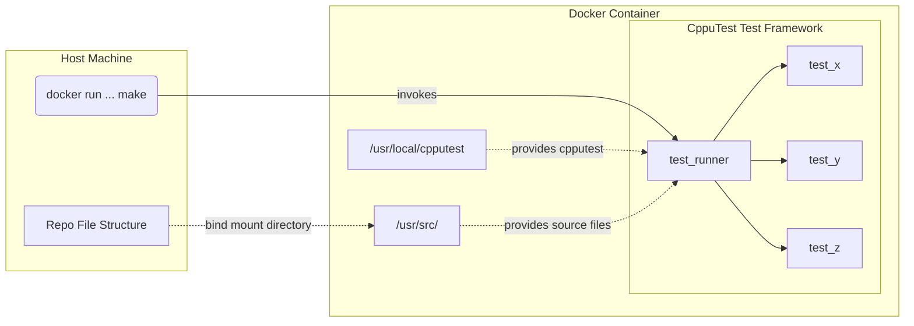

# Dockerized Testing
The intention on this project is for it to be used as a starting point for integrating dockerized unit testing into embedded projects. The main benefit from this is the ability to run unit tests in a CI/CD pipeline as a pre-merge sanity check.
## Overview

Running unit tests this way also comes with the benefit of being able to make changes to the codebase on your local machine and quickly re-testing via the running container since the volume is bind mounted to the container.
